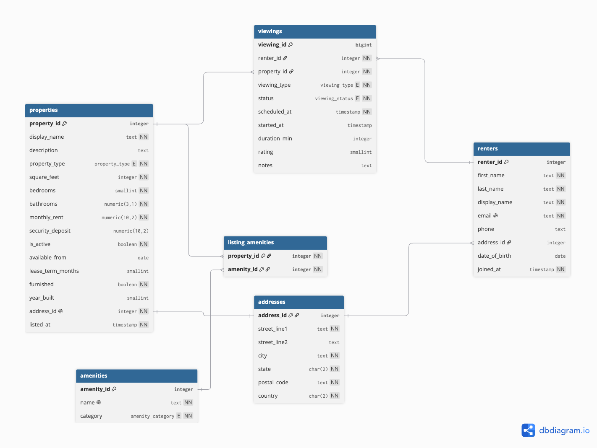

# EX 603 — Rental Marketplace Database

**Author:** Admas
**Theme:** Rental Marketplace (theme 4)

This project is a PostgreSQL database for a rental marketplace. It tracks renters, the properties they are interested in, the viewings they schedule, and the amenities associated with each listing. The goal is to have a schema that can answer practical marketplace questions around listing demand, renter behavior, and which property features drive the most interest.

All renter and property data in this repository is synthetic. No real people or addresses are used.

## The domain

The marketplace has two main sides: properties and renters.

Properties are the rental listings available on the platform. Each property has an address, physical details such as bedrooms, bathrooms, size, and property type, as well as rental terms such as monthly rent, security deposit, lease length, and available move-in date. A property can be active or retired, but it is not deleted when it leaves the marketplace because its historical activity is still useful.

Renters are the users looking for a place to live. They create accounts and schedule viewings for properties they are interested in.

The main activity in the system is a viewing. A viewing connects a renter to a property at a specific date and time. It can be in-person, virtual, or self-guided and can end as completed, cancelled, no-show, or remain scheduled. For completed viewings, the system also records how long the viewing lasted and optionally the renter's rating.

I treat viewings as the fact table because it is where most of the activity and data volume will be. The number of renters and properties should grow relatively slowly, while the platform could generate thousands of viewing records per day.

This structure lets the database answer questions that would matter to someone operating the marketplace. For example: Which properties are getting the most viewings? Are virtual viewings shorter than in-person ones? Does viewing duration correlate with renter interest? Which amenities are associated with longer viewings? How does the rent-to-deposit ratio differ across property types? How does viewing activity change by day of the week or throughout the year?

Most of these questions come back to querying viewings, joining them to properties, and using listing_amenities when property features are part of the analysis.

## Schema

The database has six relations: the five roles required by the theme and one supporting relation.

| Role       | Relation            | Primary key                 | Purpose                                                  |
| ---------- | ------------------- | --------------------------- | -------------------------------------------------------- |
| actor      | `renters`           | `renter_id`                 | Renters who book property viewings                       |
| producer   | `properties`        | `property_id`               | Rental listings available on the platform                |
| event      | `viewings`          | `viewing_id`                | One row for each scheduled property viewing              |
| catalog    | `amenities`         | `amenity_id`                | Features used to describe and classify listings          |
| junction   | `listing_amenities` | `(property_id, amenity_id)` | Many-to-many link between listings and amenities         |
| supporting | `addresses`         | `address_id`                | Shared address structure for both renters and properties |

## Query catalogue

| Unit | File | Business question |
| ---- | ---- | ----------------- |
| —    | —    | Added from Unit 3 |

## Technical highlights

_Added from Unit 3 onward._

## What I would do differently

_Written in Unit 6._

## Video presentation

_Linked in Unit 6._

## How to run it

_Commands added once the DDL exists in Unit 2._
